<!--suppress ALL -->

[![header]][home]

  

      
      
  

    <a>
        
        <a>
            <h1 align="center">Contact Me</h1>
            

                QQ : 3193171635  
                Email :  <a href="mailto:DGHDidi233@gmail.com">DGHDidi233@gmail.com</a>  
                Twitter :  <a href="https://twitter.com/DGH_Didi">@DGH_Didi</a>  
<!--                 Telegram :  <a href="https://t.me/DGH_Didi">@DGH_Didi</a>   -->
                Discord : DGH_Did #8202 
            

        </a>
    </a>
     

	

    Designed with :heart: by <a href="https://github.com/DGHDidi" target="_blank">DGH_Didi</a>.

[home]: https://github.com/DGH_Didi
[header]: https://capsule-render.vercel.app/api?type=Waving&color=timeGradient&height=200&animation=fadeIn&section=header&text=DGH_Didi&fontSize=50
